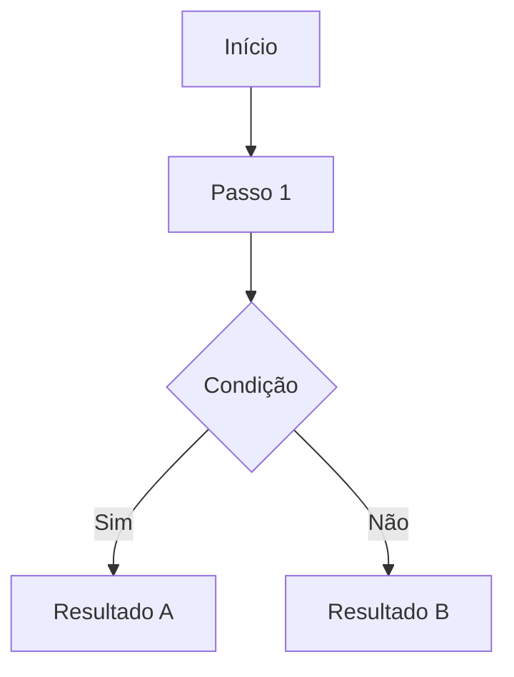

Skill de geração e atualização de documentação. Executada pela **Gema**.

$ARGUMENTS

---

## Passo 1 — Confirmar público-alvo (OBRIGATÓRIO antes de qualquer coisa)

Antes de escrever uma linha, perguntar:

> "Esta documentação é para **humano** ou para **IA**?
> Se for para IA, qual? (Claude, ChatGPT/GPT-4, Gemini, Codex/Copilot, outro)"

O estilo de escrita, estrutura e nível de detalhamento dependem diretamente desta resposta. Não pule esse passo.

---

## Passo 2 — Auditoria de documentação existente

Antes de criar qualquer documento, varrer os diretórios relevantes:

```
docs/
README.md
README-*.md
.claude/
CHANGELOG.md
<módulo>/README.md
<feature>/docs/
```

Para cada documento encontrado relacionado ao escopo solicitado:

1. **Ler o documento** completo.
2. **Comparar com o estado atual** do produto (código, agentes, fluxos, comportamento real).
3. **Classificar:**
   - `VÁLIDO` — conteúdo atual, estrutura adequada → reutilizar ou fazer ajuste pontual.
   - `PARCIAL` — parte do conteúdo válida, parte desatualizada → atualizar.
   - `OBSOLETO` — conteúdo desatualizado, estrutura incompatível, ou feature removida → arquivar.

### Regra de arquivamento

Quando classificado como `OBSOLETO`:
1. Criar diretório `.old/` no mesmo local do arquivo (ex: `docs/.old/`).
2. Renomear o arquivo com sufixo de data: `nome-original.YYYY-MM-DD.old.md`.
3. Mover para `.old/`.
4. Gerar documento novo no path original.

```bash
# Exemplo de arquivamento
mkdir -p docs/.old
mv docs/feature-speedtest.md docs/.old/feature-speedtest.2024-01-15.old.md
```

---

## Passo 3 — Confirmar escopo: SignallQ Android ou SignallQ Admin

O produto é Android nativo (Kotlin/Compose). O "SignallQ Admin" (React/TS) é um produto separado, documentado à parte quando explicitamente solicitado.

| Critério | Escopo |
|---|---|
| Feature, tela, fluxo do app SignallQ | Android |
| Painel administrativo, análise de dados, métricas | SignallQ Admin |

Se o pedido não deixar claro qual dos dois, perguntar antes de gerar o documento.

---

## Passo 4 — Gerar o documento

### Estrutura padrão por tipo

#### Documentação Funcional

```markdown
# [Nome da Feature]

**Status:** Em desenvolvimento | Concluída | Planejada
**Versão:** x.x.x
**Última atualização:** YYYY-MM-DD

## Visão geral
[1-3 frases descrevendo o que a feature faz e por que existe]

## Público-alvo
[Quem usa e em que contexto]

## Fluxo principal
[Diagrama mermaid ou lista numerada de passos]

## Regras de negócio
- [Regra 1]
- [Regra 2]

## Edge cases
| Cenário | Comportamento esperado |
|---|---|
| [caso] | [resultado] |

## Critérios de aceite
- [ ] [Critério 1]
- [ ] [Critério 2]
```

#### Documentação Técnica

```markdown
# [Módulo / Componente / API]

**Módulo:** :[nome-do-modulo]
**Última atualização:** YYYY-MM-DD

## Responsabilidade
[O que este módulo faz. Uma ou duas frases.]

## Dependências
| Dependência | Motivo |
|---|---|
| [dep] | [por que existe] |

## Arquitetura
[Diagrama mermaid ou descrição de camadas]

## Interfaces públicas
[Funções, classes ou endpoints expostos com assinatura e descrição]

## Decisões de design
- **[Decisão]:** [por que foi tomada, alternativas consideradas]

## Limitações conhecidas
- [Limitação 1]
```

#### Documentação de Testes

```markdown
# Plano de Testes — [Feature]

**Última atualização:** YYYY-MM-DD

## Cobertura atual

| Área | Cobertura |
|---|---|
| [área] | ✅ / ⚠️ / ❌ |

## Casos de teste

### [Nome do caso]
- **Dado:** [pré-condição]
- **Quando:** [ação]
- **Então:** [resultado esperado]

## Cenários de regressão
[O que nunca pode quebrar]

## O que não está coberto (e por quê)
- [lacuna]: [motivo]
```

#### Documentação de Fluxo

```markdown
# Fluxo — [Nome]

**Última atualização:** YYYY-MM-DD

## Diagrama



## Descrição por passo
1. **[Passo 1]:** [descrição]
2. **[Passo 2]:** [descrição]

## Estados possíveis
| Estado | Trigger | UI |
|---|---|---|
| [estado] | [o que causa] | [o que o usuário vê] |

## Integrações
- [sistema ou módulo que participa do fluxo]
```

#### Documentação de Design

```markdown
# Design — [Tela / Componente]

**Última atualização:** YYYY-MM-DD

## Componentes visuais

| Componente | Composable | Token MD3 |
|---|---|---|
| [comp] | [Composable] | [token] |

## Estados visuais
| Estado | Trigger | Aparência |
|---|---|---|
| loading | [quando] | [descrição ou shimmer] |
| erro | [quando] | [mensagem + ação] |
| sucesso | [quando] | [feedback visual] |
| vazio | [quando] | [empty state] |

## Microcopy
| Elemento | Texto | Observação |
|---|---|---|
| [botão/label] | "[texto exato]" | [contexto] |

## Tokens utilizados
- Cor primária: `[token]`
- Tipografia: `[token]`
- Espaçamento: `[token]`
```

---

## Passo 5 — Formato HTML (quando solicitado)

Quando o output for um documento HTML:

```html
<!DOCTYPE html>
<html lang="pt-BR">
<head>
  <meta charset="UTF-8">
  <meta name="viewport" content="width=device-width, initial-scale=1.0">
  <title>[Título do documento] — SignallQ</title>
  <style>
    /* Paleta SignallQ */
    :root {
      --color-primary: #1A73E8;
      --color-surface: #F8F9FA;
      --color-on-surface: #202124;
      --color-outline: #DADCE0;
      --color-accent: #34A853;
      --font-main: 'Google Sans', 'Roboto', sans-serif;
      --font-mono: 'Roboto Mono', monospace;
    }
    body {
      font-family: var(--font-main);
      color: var(--color-on-surface);
      background: var(--color-surface);
      margin: 0;
      display: flex;
    }
    nav {
      width: 240px;
      min-height: 100vh;
      background: white;
      border-right: 1px solid var(--color-outline);
      padding: 24px 16px;
      position: sticky;
      top: 0;
    }
    main {
      flex: 1;
      padding: 40px 48px;
      max-width: 900px;
    }
    /* ... demais estilos */
  </style>
</head>
<body>
  <nav><!-- sidebar de navegação --></nav>
  <main><!-- conteúdo principal --></main>
</body>
</html>
```

Requisitos obrigatórios para HTML:
- Sidebar de navegação com âncoras internas.
- Breadcrumbs no topo do conteúdo.
- Responsivo (collapse de sidebar em telas pequenas).
- Sem dependências externas de CDN (tudo inline ou assets locais).
- Dark mode via `prefers-color-scheme`.

---

## Passo 6 — Estrutura PPT (quando solicitado)

Quando o output for uma apresentação:

**Sequência de slides obrigatória:**
1. **Capa** — título, subtítulo, data, logo SignallQ.
2. **Problema** — o que motivou esta feature/decisão.
3. **Solução** — o que foi construído ou proposto.
4. **Fluxo** — diagrama simplificado do fluxo principal.
5. **Métricas / Critérios de aceite** — como medir sucesso.
6. **Riscos e limitações** — o que ainda não está resolvido.
7. **Próximos passos** — o que vem depois.

**Identidade visual:**
- Fundo: branco ou cinza muito claro (`#F8F9FA`).
- Cor primária: `#1A73E8` (cabeçalhos, destaques).
- Cor de acento: `#34A853` (ícones positivos, marcadores de sucesso).
- Tipografia: Google Sans (títulos), Roboto (corpo).
- Sem clipart. Sem degradê. Sem sombra pesada.

Gerar o PPT via python-pptx quando o ambiente tiver o pacote disponível, ou entregar a estrutura em markdown para conversão manual.

---

## Passo 7 — Ajuste de estilo por público-alvo

### Para IA — Claude
- Usar seções delimitadas com `##` e `###`.
- Regras antes de exemplos.
- Edge cases como itens separados, não em prosa.
- Contexto autocontido — não depender de sessão anterior.
- Preferir tabelas a listas quando houver múltiplos atributos.

### Para IA — ChatGPT / GPT-4
- Markdown limpo, sem sintaxe avançada.
- Instruções numeradas.
- System prompt separado de conteúdo de referência.
- Exemplos de input/output explícitos.

### Para IA — Gemini
- Seções bem delimitadas.
- Tabelas preferidas.
- Contexto de plataforma explicitado no início de cada seção.

### Para IA — Codex / Copilot
- Foco em comentários inline e docstrings.
- Estrutura orientada a código.
- Convenções de nomenclatura com exemplos.

### Para Humano
- Linguagem direta, sem jargão desnecessário.
- Exemplos concretos do produto real.
- Hierarquia visual clara.
- Tom profissional e acessível.

---

## Checklist de entrega

Documento só é considerado entregue quando:

- [ ] Público-alvo confirmado (humano / IA / qual IA)
- [ ] Auditoria de docs existentes realizada
- [ ] Documentação obsoleta movida para `.old/` (quando aplicável)
- [ ] Escopo confirmado (SignallQ Android ou SignallQ Admin)
- [ ] Documento gerado no formato correto para o público
- [ ] Path de saída informado
- [ ] Conteúdo ancoragem no código/comportamento real (não inventado)
- [ ] Edge cases documentados

---

## Coleta de contexto

Usar ferramentas nativas (Glob, Grep, Read) para buscas em código e documentação. Delegar a agente especializado apenas quando a tarefa exigir julgamento:

| Lacuna | Consultar |
|---|---|
| Comportamento técnico Android | Camilo |
| Comportamento técnico SignallQ Admin | Felipe |
| Validação de device real, OEM, API level | `/regras-android` |
| Decisão de arquitetura, fluxo de dados | Claudete |
| Estados visuais, microcopy, MD3 | Lia |
| QA, bugs conhecidos, risco documentado | Gema |
| Direção de produto | Claudete |

[PRÓXIMO: entregar o documento no path solicitado com checklist de entrega preenchido]
