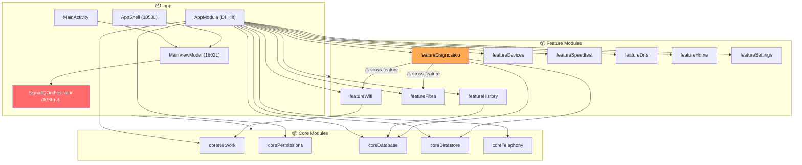
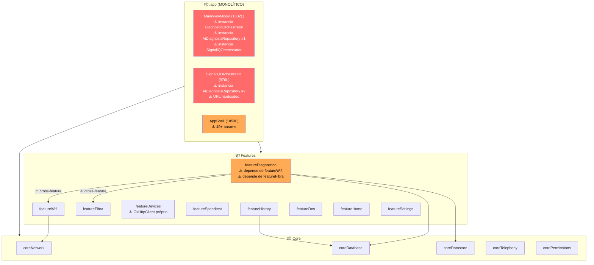
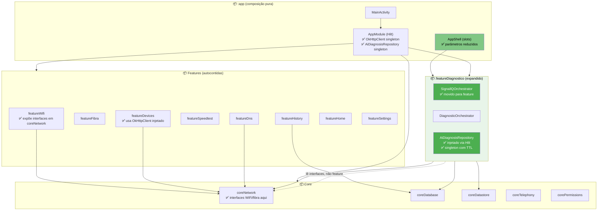

# Relatório de Arquitetura — SignallQ Android

> **Tipo:** Read-only / análise  
> **Data:** 2026-06-21  
> **Versão auditada:** 0.16.0 (versionCode 46) → confirmado como 0.18.1 no Explore  
> **Evidência de versão real:** `gradle/libs.versions.toml` (campo `version.name`)  
> **Status:** Aguardando aprovação — nenhum arquivo de produção foi modificado.

---

## Seção 1 — Arquitetura atual (o que É)

### Stack e build detectados

| Componente | Versão | Evidência |
|---|---|---|
| Kotlin | 2.2.20 | `gradle/libs.versions.toml` |
| AGP | 8.11.1 | `gradle/libs.versions.toml` |
| Compose BOM | 2025.05.01 | `gradle/libs.versions.toml` |
| Coroutines | 1.9.0 | `gradle/libs.versions.toml` |
| Room | 2.8.4 | `gradle/libs.versions.toml` |
| Hilt | 2.56.2 | `gradle/libs.versions.toml` |
| OkHttp | 4.12.0 | `gradle/libs.versions.toml` |
| WorkManager | 2.10.1 | `gradle/libs.versions.toml` |
| minSdk / targetSdk | 24 / 36 | `gradle/libs.versions.toml` |

Stack: **Kotlin nativo + Jetpack Compose**. Sem Flutter, sem React Native. DI: Hilt (`AppModule.kt`). Persistência: Room + DataStore. Background: WorkManager com `CoroutineWorker`. Nenhum `pubspec.yaml` encontrado.

---

### Mapa de módulos e direção real de dependências

15 módulos Gradle declarados em `settings.gradle.kts:20-36`:

| Camada | Módulo | Depende de (projeto) |
|---|---|---|
| App | `:app` | todos os 14 abaixo (`app/build.gradle.kts:199-212`) |
| Core | `:coreNetwork` | — |
| Core | `:corePermissions` | — |
| Core | `:coreDatabase` | — |
| Core | `:coreDatastore` | — |
| Core | `:coreTelephony` | — |
| Feature | `:featureHome` | — |
| Feature | `:featureWifi` | `:coreNetwork` (`featureWifi/build.gradle.kts:28`) |
| Feature | `:featureDevices` | — (dependências externas: AndroidNetworkTools, jmDNS, OkHttp) |
| Feature | `:featureDns` | — |
| Feature | `:featureSpeedtest` | — |
| **Feature** | **`:featureDiagnostico`** | **`:featureFibra`, `:featureWifi`, `:coreDatabase`, `:coreDatastore`** (`featureDiagnostico/build.gradle.kts:30-33`) |
| Feature | `:featureFibra` | — |
| Feature | `:featureHistory` | `:coreDatabase` (`featureHistory/build.gradle.kts:28`) |
| Feature | `:featureSettings` | — |

**Observação crítica:** `featureDiagnostico` importa `featureWifi` e `featureFibra`. Isso viola o princípio de que features são folhas independentes — a dependência é entre peers, não descendo para core.

Além disso, `SignallQOrchestrator.kt` (976 linhas) vive em `app/src/main/kotlin/io/veloo/app/kotlin/pulse/` — código de orquestração de negócio dentro do módulo `:app`, que deveria ser exclusivamente de composição.

---

### Diagrama da arquitetura atual



**Legenda:** ⚠️ vermelho = código de negócio no lugar errado; laranja = dependência cruzada entre features.

---

### Fluxo do dado principal: scan → processamento → UI

```
Usuário toca "Iniciar Teste"
        │
        ▼
AppShell.onNovoTeste(modo)                          [app/AppShell.kt]
        │
        ▼
MainViewModel.reiniciarSuite(modo)                  [MainViewModel.kt]
        │
        ▼
SignallQOrchestrator.iniciarDiagnosticoComResultado [pulse/SignallQOrchestrator.kt]
        │
        ├─► ExecutorSpeedtestCloudflare.executar()  [featureSpeedtest] → Cloudflare Worker HTTP
        │
        ├─► DiagnosticOrchestrator.executar()       [featureDiagnostico] → 6 engines locais
        │       ├─ WifiSignalQualityEngine
        │       ├─ InternetDiagnosticEngine
        │       ├─ DiagnosticDecisionEngine
        │       ├─ UpnpIgdDiscovery (MulticastLock) [featureDiagnostico/topology]
        │       └─ TopologiaWifiEngine               [featureWifi]  ← cross-feature import
        │
        ├─► AiDiagnosisRepository.explainDiagnosis  [featureDiagnostico] → Cloudflare Worker AI
        │       └─ cache: ConcurrentHashMap (sem TTL)
        │
        └─► SignallQOrchestrator.snapshotFlow        [StateFlow<SignallQSnapshot>]
                │
                ▼
        SignallQUiStateMapper.from(snapshot)         [app]
                │
                ▼
        AppShell overlay ResultadoVelocidade         [app/AppShell.kt]
```

---

## Seção 2 — Auditoria por lente

### 2A — Performance

| Problema | Arquivo:Linha | Severidade | Impacto concreto |
|---|---|---|---|
| `AiDiagnosisRepository` instanciada **duas vezes**: uma em `MainViewModel`, outra em `SignallQOrchestrator`. Dois caches `ConcurrentHashMap` independentes, sem coordenação. | `MainViewModel.kt:173-178` + `SignallQOrchestrator.kt:122-126` | **Alta** | Diagnóstico igual solicitado de dois caminhos retorna resposta do Worker duas vezes (cache miss na segunda instância), dobro de latência e tokens. |
| `checkAvailability()` cria um **novo** `OkHttpClient` a cada chamada (`availabilityClient`), descartando o connection pool do cliente principal. | `AiDiagnosisRepository.kt:71-74` | **Alta** | Cada verificação de disponibilidade abre um novo TCP handshake + TLS para o Worker, adicionando ~200-500ms extras antes de cada diagnóstico. |
| **Três pools HTTP independentes**: `ScannerDispositivosAndroid` (UPnP fetch), `UpnpIgdDiscovery` (IGD), `AiDiagnosisRepository` (IA). Conexões não são reutilizadas entre eles. | `ScannerDispositivosAndroid.kt:91-97` · `UpnpIgdDiscovery.kt:17-21` · `AiDiagnosisRepository.kt:46-54` | **Média** | Seis ou mais conexões TCP paralelas para o mesmo gateway local durante um scan profundo. Pode atingir limite de conexões simultâneas em roteadores mais simples. |
| `AppShell` recebe **40+ parâmetros** em sua assinatura. Qualquer mudança em qualquer `StateFlow` subscrito na `MainActivity` força recomposição de toda a árvore do `AppShell`. | `AppShell.kt:127-220` (assinatura da função) | **Média** | Mudança de sinal Wi-Fi (reemitida a cada `onCapabilitiesChanged`) pode disparar recomposição global incluindo tabs não visíveis. |
| `HomeScreen.kt` (3487L), `SinalScreen.kt` (2998L), `AjustesScreen.kt` (2323L) são Composable functions monolíticas sem slots nem `@Stable` nos parâmetros. | `HomeScreen.kt:1` · `SinalScreen.kt:1` · `AjustesScreen.kt:1` (tamanhos confirmados via `wc -l`) | **Média** | Composables grandes com muitos parâmetros instáveis inibem o skip de recomposição do Compose runtime. |
| `AiDiagnosisRepository.cache` é um `ConcurrentHashMap` sem TTL. A chave é MD5 do contexto: se o diagnóstico mudar (nova medição), mas o contexto passado for igual, retorna resultado obsoleto. | `AiDiagnosisRepository.kt:60` · `AiDiagnosisRepository.kt:102-103` | **Média** | Troca rápida de rede (Wi-Fi → móvel) na mesma sessão pode retornar diagnóstico do estado anterior. |
| `DiagnosticoScreen.kt` (1037L), `ChatDiagnosticoIaScreen.kt` (1063L), `DispositivosScreen.kt` (1194L) — UI de feature sem decomposição em sub-composables menores. | Tamanhos confirmados via `wc -l` | **Baixa** | Aumento de complexidade futura; composables nesse tamanho são candidatos naturais a recomposições desnecessárias. |

---

### 2B — Economia de energia

| Problema | Arquivo:Linha | Severidade | Impacto concreto |
|---|---|---|---|
| `MulticastLock("signallq_jmdns")` tem `setReferenceCounted(false)` mas não usa guard explícito antes de `acquire()` — se `acquire()` for chamada duas vezes sem `release()` entre elas (ex: scan cancelado e reiniciado em race condition), o lock não acumula contagem e o segundo `release()` em `finally` pode lançar `RuntimeException` silenciada pelo `runCatching`. | `ScannerDispositivosAndroid.kt:418-420` · linha `497` | **Média** | Em race condition, o lock multicast pode ficar adquirido sem contraparte de release, aumentando o consumo de rádio durante toda a sessão. |
| `UpnpIgdDiscovery.discoverLocation()` adquire `MulticastLock` dentro de um método **não-suspend** chamado de coroutine. A aquisição é síncrona na thread de coroutine (IO), mas se o coroutineScope for cancelado durante `socket.receive()`, a exceção de cancelamento pula o `finally`... **não**: o `finally` executa mesmo em `CancellationException`. Análise: o release em `finally { runCatching { lock.release() } }` é correto. | `UpnpIgdDiscovery.kt:29-60` | **Baixa** | Padrão correto. Documentado aqui apenas para clareza — o `runCatching` cobre o caso de lock já liberado. |
| `MonitorRedeAndroid` usa `Handler(Looper.getMainLooper())` para debouncing de `onLost` (2000ms) e retry de `NET_CAPABILITY_VALIDATED` (600ms). Os Runnables são removidos em `encerrar()`, mas `encerrar()` é chamado em `onStop`. Se `onStop` não for chamado (processo killed), os Runnables ficam pendentes até GC do Handler. | `MonitorRedeAndroid.kt:36` · `64-65` · `86` · `95-96` | **Baixa** | Risco teórico apenas em kill forçado de processo; na prática os Runnables ficam na fila da main thread até processo terminar, sem impacto real de bateria. |
| `coreTelephony/MonitorTelephonyImpl.kt` (592L) registra `TelephonyCallback` que recebe eventos de sinal celular continuamente. Não há throttle de eventos nem guard contra chamada repetida de `iniciar()`. | `MonitorTelephonyImpl.kt:1` (tamanho via `wc -l`) · linha de `iniciar()` a confirmar | **Baixa** | Callbacks de TelephonyManager têm frequência controlada pelo sistema, mas múltiplos registros acidentais (se `iniciar()` chamado mais de uma vez sem `encerrar()`) duplicariam eventos e processamento. O `callbackRegistrado` guard existe em `MonitorRedeAndroid.kt:78` — verificar se `MonitorTelephonyImpl` tem guard análogo (a confirmar via leitura da função `iniciar()`). |

**Positivos confirmados (documentados para não perder):**
- `MulticastLock("signallq_jmdns")` em `ScannerDispositivosAndroid.kt:496-498`: `if (multicastLock.isHeld) multicastLock.release()` no `finally` — correto.
- `MulticastLock("signallq_topology_ssdp")` em `UpnpIgdDiscovery.kt:60`: `finally { runCatching { lock.release() } }` — correto.
- `MonitoramentoScheduler`: `PeriodicWorkRequestBuilder(30, MINUTES)` com `NetworkType.CONNECTED` + `setRequiresBatteryNotLow()` — correto.
- Sem `WakeLock` (`PARTIAL_WAKE_LOCK` / `FULL_WAKE_LOCK`) detectado no projeto.
- `ScannerDispositivosAndroid.kt:100-115`: guard de Wi-Fi — rejeita scan em rede móvel imediatamente.

---

### 2C — Clean Architecture / Manutenção

| Problema | Arquivo:Linha | Severidade | Impacto concreto |
|---|---|---|---|
| `featureDiagnostico` depende de `featureWifi` e `featureFibra` — dependência entre peers no mesmo nível de feature. | `featureDiagnostico/build.gradle.kts:31-32` | **Alta** | Não é possível construir, testar ou reusar `featureDiagnostico` sem compilar também `featureWifi` e `featureFibra`. Qualquer mudança de API em `featureWifi` quebra `featureDiagnostico`. |
| `SignallQOrchestrator` (976L) vive em `app/pulse/` — lógica de negócio de alto nível (fluxo speedtest + diagnóstico + IA + perguntas dinâmicas) dentro do módulo `:app`, que deveria ser exclusivamente de composição DI + navegação. | `app/src/main/kotlin/io/veloo/app/kotlin/pulse/SignallQOrchestrator.kt` | **Alta** | Código de domínio não testável em isolamento (precisa do contexto do módulo `:app`). Dependência acidental de `:app` em todos os sub-módulos de `SignallQOrchestrator`. |
| `MainViewModel` (1602L) importa **todos os 14 módulos** (linhas 21-55) e instancia `DiagnosticOrchestrator`, `SignallQOrchestrator`, `AvaliadorCoerenciaDns`, `AiDiagnosisRepository` via `lazy {}` — fora do grafo Hilt. | `MainViewModel.kt:21-55` (imports) · `109-131` (lazy inits) · `173-178` (`diagAiRepository`) | **Alta** | ViewModel não é testável sem instanciar 14 módulos. `lazy {}` bypassa Hilt e cria acoplamento hard-coded. |
| `AiDiagnosisRepository` instanciada duas vezes com URL hardcoded, fora do Hilt: uma no `MainViewModel` e outra dentro de `SignallQOrchestrator`. | `MainViewModel.kt:173-178` · `SignallQOrchestrator.kt:122-126` | **Alta** | URL (`linka-ai-diagnosis-worker...workers.dev`) duplicada em dois arquivos (`MainViewModel.kt:175` e `SignallQOrchestrator.kt:50`). Dois caches `ConcurrentHashMap` desconexos. Impossível injetar mock em testes sem modificar ambos. |
| `ExecutorSpeedtestCloudflare.kt` (1342L) — maior arquivo de feature module. | `featureSpeedtest/src/.../ExecutorSpeedtestCloudflare.kt` | **Média** | A confirmar se contém múltiplas responsabilidades (parsing, retry, persistência). Candidato a extração. |
| `ChatDiagnosticoIaViewModel` (1016L) tem lógica de chat, gerenciamento de sessão Room, e chamada direta à IA — três responsabilidades em um ViewModel. | `app/src/main/kotlin/io/veloo/app/kotlin/ui/viewmodel/ChatDiagnosticoIaViewModel.kt` | **Média** | ViewModel faz I/O de banco, chamada HTTP e state management. Testar qualquer aspecto isolado requer mockar os outros dois. |
| `AppShell` declara `enum class Overlay` com 12 valores incluindo `DiagnosticoInteligente` marcado como `@deprecated` mas nunca removido. | `AppShell.kt:108-123` | **Baixa** | Dead code no enum mantido como "fallback". Sem risco imediato, mas indica que overlays são adicionados sem remoção de predecessor. |
| Três locais com URL do worker hardcoded como String literal: `MainViewModel.kt:175`, `SignallQOrchestrator.kt:50`, e potencialmente `AiDiagnosisRepository.kt` (injetada via parâmetro). | `MainViewModel.kt:175` · `SignallQOrchestrator.kt:50` | **Baixa** | Mudança de URL requer grep em vez de mudar uma constante central. |

---

## Seção 3 — Arquitetura ideal (o que DEVE ser)

### Padrão escolhido: Clean Architecture + MVVM com módulos por feature autocontidos

**Justificativa por lente:**

- **Performance:** Features autocontidas com ViewModel próprio reduzem o escopo de `StateFlow` coletados por componente, diminuindo o número de recomposições. Um `OkHttpClient` singleton no Hilt elimina os três pools paralelos.
- **Energia:** `SignallQOrchestrator` extraído do `:app` para um módulo próprio (ou `featureDiagnostico`) permite testar seu ciclo de vida (e garantir que MulticastLocks sejam liberados em cancelamento) sem a overhead do módulo `:app`.
- **Manutenção:** Features sem dependência cruzada entre si permitem compilação incremental real. Hilt como único ponto de criação de objetos elimina as instâncias duplicadas e torna todos os componentes mockáveis em testes.

**O que NÃO muda:** a separação em módulos Gradle já existe e está no caminho certo. A proposta não reescreve do zero — recorta responsabilidades dentro da estrutura atual.

---

### Comparativo visual: atual vs. ideal

#### Atual (reproduzido da Seção 1 — com problemas destacados)



#### Ideal (alvo — mesma convenção de cores)



**Diferença visual chave:** as setas ⚠️ de `featureDiagnostico → featureWifi/featureFibra` somem; `SignallQOrchestrator` e `AiDiagnosisRepository` saem do vermelho (`:app`) para o verde (`featureDiagnostico`); `AppShell` passa de 40+ params para slots de Composable.

---

### Tabela de mapeamento antes → depois

| Componente atual (arquivo) | Camada atual | Camada alvo | O que muda |
|---|---|---|---|
| `SignallQOrchestrator.kt` | `:app/pulse/` | `:featureDiagnostico` | Move para feature module; URL do worker vira constante em `BuildConfig` ou injetada |
| `AiDiagnosisRepository` (2ª instância em `SignallQOrchestrator.kt:122-126`) | Inline no orquestrador | Injetada via Hilt `@Singleton` | Remove instanciação manual; AppModule provê única instância |
| `AiDiagnosisRepository` (1ª instância em `MainViewModel.kt:173-178`) | Lazy no ViewModel | Injetada via Hilt `@Inject` | Remove `diagAiRepository by lazy { AiDiagnosisRepository(...) }` |
| `DiagnosticOrchestrator` (`MainViewModel.kt:113`) | Lazy no ViewModel | `@Inject` em `MainViewModel` ou movido para `SignallQOrchestrator` | Remove `by lazy { DiagnosticOrchestrator() }` |
| `featureDiagnostico → featureWifi` (`build.gradle.kts:31`) | Dependência de projeto | `featureDiagnostico → coreNetwork` (interfaces) | `TopologiaWifiEngine` expõe resultado via interface em `coreNetwork` |
| `featureDiagnostico → featureFibra` (`build.gradle.kts:32`) | Dependência de projeto | `featureDiagnostico → coreNetwork` (interfaces) | `EstadoFibra` / resultado de fibra exposto via interface em `coreNetwork` ou `coreDatabase` |
| `AppShell.kt` (1053L, 40+ params) | `:app` — monolítico | `:app` — slots/composable delegation | Parâmetros agrupados em data classes por feature; cada overlay vira `@Composable` slot |
| `MainViewModel.kt` (1602L) | `:app` — god ViewModel | Dividido: `DiagnosticoViewModel`, `DevicesViewModel`, `SpeedtestViewModel` | Cada feature ViewModel injeta apenas os módulos de que precisa |
| `OkHttpClient` em `ScannerDispositivosAndroid.kt:91-97` | Lazy local na classe | `AppModule` provê `@Singleton` | Remove `okHttpClient by lazy { OkHttpClient.Builder()... }` |
| `OkHttpClient` em `UpnpIgdDiscovery.kt:17-21` | Construtor default | Injetado ou recebido por parâmetro | Remove instância local |
| `DiagnosticoInteligente` overlay (`AppShell.kt:113`) | Dead code (`@deprecated`) | Removido | `enum class Overlay` perde um valor |

---

### O que a arquitetura-alvo resolve por lente

**Performance:**
- `AiDiagnosisRepository` como `@Singleton` no Hilt elimina o duplo cache (`MainViewModel.kt:173-178` + `SignallQOrchestrator.kt:122-126`). Um único `ConcurrentHashMap` com TTL serve ambos os fluxos.
- `OkHttpClient` singleton elimina os três pools paralelos (`ScannerDispositivosAndroid.kt:91-97`, `UpnpIgdDiscovery.kt:17-21`, `AiDiagnosisRepository.kt:46-54`) e o `availabilityClient` criado por chamada (`AiDiagnosisRepository.kt:71-74`).
- `AppShell` com slots e parâmetros agrupados em data classes `@Stable` reduz a superfície de recomposição: mudança de sinal Wi-Fi não recompõe a tab de Histórico.

**Energia:**
- `SignallQOrchestrator` em módulo próprio torna testável o ciclo de vida do orquestrador sem a overhead do `:app`. Testes de unidade podem verificar que locks multicast são liberados em todos os caminhos (incluindo cancelamento de coroutine), eliminando o risco de race condition identificado em `ScannerDispositivosAndroid.kt:418-420`.
- Features sem dependência cruzada permitem testes de integração que exercitam exatamente o código de scan de dispositivos ou fibra, sem inicializar módulos não relacionados que poderiam registrar callbacks desnecessários.

**Clean Architecture / Manutenção:**
- Remoção de `featureDiagnostico → featureWifi/featureFibra` (`build.gradle.kts:31-32`) elimina acoplamento entre features. `featureDiagnostico` passa a consumir interfaces de `coreNetwork` — mudança de implementação em `featureWifi` não afeta mais `featureDiagnostico`.
- `MainViewModel` dividido em ViewModels por feature: cada ViewModel injeta apenas os módulos de que precisa. `DevicesViewModel` injeta `ScannerDispositivos`; `DiagnosticoViewModel` injeta `DiagnosticOrchestrator`; `SpeedtestViewModel` injeta `ExecutorSpeedtest`. Testáveis individualmente.
- URL do worker em um único lugar (`BuildConfig` ou constante em `featureDiagnostico`) elimina duplicação em `MainViewModel.kt:175` e `SignallQOrchestrator.kt:50`.

---

## Seção 4 — Plano de migração incremental

Regra geral: cada passo tem um PR verificável. Nenhum big-bang. A ordem vai do mais seguro ao mais estrutural.

---

### Passo 1 — Unificar `AiDiagnosisRepository` no Hilt (baixo risco)

**O que muda:**
1. Adicionar `DiagnosticoModule.kt` em `featureDiagnostico/src/main/kotlin/.../di/` com `@Provides @Singleton fun provideAiDiagnosisRepository(...)`.
2. Importar `DiagnosticoModule` em `AppModule.kt` ou anotá-lo com `@InstallIn(SingletonComponent::class)`.
3. Remover `diagAiRepository by lazy { AiDiagnosisRepository(...) }` em `MainViewModel.kt:173-178`.
4. Remover `private val aiRepository = AiDiagnosisRepository(...)` em `SignallQOrchestrator.kt:122-126`; receber via construtor.
5. Centralizar URL do worker em `BuildConfig` (campo no `build.gradle.kts`).

**Risco:** Baixo. A interface de `AiDiagnosisRepository` não muda; apenas o ponto de criação.

**Validação:** `./gradlew test` passa. Diagnóstico e chat continuam funcionando. Logs mostram uma única instância (adicionar log de `hashCode()` temporário no `init` do repository).

---

### Passo 2 — Unificar `OkHttpClient` singleton (baixo risco)

**O que muda:**
1. `AppModule.kt`: `@Provides @Singleton fun provideOkHttpClient(): OkHttpClient = OkHttpClient.Builder().build()`.
2. `ScannerDispositivosAndroid.kt:91-97`: remover `okHttpClient by lazy {...}`; receber `OkHttpClient` por construtor (já injetado via `FeatureDevicesModulo.criarScannerDispositivos`).
3. `UpnpIgdDiscovery.kt:17-21`: remover instância local; receber por construtor.
4. `AiDiagnosisRepository`: manter próprio `OkHttpClient` com readTimeout 90s — os timeouts são específicos para IA e não devem ser compartilhados com UPnP (1.5s).

**Risco:** Baixo. O `OkHttpClient` do `AiDiagnosisRepository` permanece separado (timeouts diferentes); apenas o cliente UPnP/scan é unificado.

**Validação:** Scan de dispositivos e topologia funcionam. Logs de conexão HTTP mostram reutilização de conexão.

---

### Passo 3 — Adicionar TTL ao cache de `AiDiagnosisRepository` (baixo risco)

**O que muda:**
- Trocar `ConcurrentHashMap<String, AiDiagnosisResult>` por `ConcurrentHashMap<String, Pair<AiDiagnosisResult, Long>>` onde `Long` é `System.currentTimeMillis()` da inserção.
- Na consulta (`AiDiagnosisRepository.kt:102-103`): invalidar entradas com mais de 5 minutos.

**Risco:** Mínimo. Só afeta cache hit rate.

**Validação:** Diagnóstico após troca de rede (Wi-Fi → móvel) retorna novo resultado, não o cacheado.

---

### Passo 4 — Mover `SignallQOrchestrator` para `featureDiagnostico` (risco médio)

**O que muda:**
1. Mover `app/src/.../pulse/SignallQOrchestrator.kt` para `featureDiagnostico/src/.../pulse/SignallQOrchestrator.kt`.
2. Ajustar imports em `MainViewModel.kt` (o import do package muda).
3. Verificar que `featureDiagnostico/build.gradle.kts` já tem as dependências necessárias (`coreNetwork`, `coreDatabase`) — sim (`build.gradle.kts:32-33`).

**Risco:** Médio. `SignallQOrchestrator` importa de `featureSpeedtest` (`ExecutorSpeedtest`) e `coreDatabase` (`MedicaoDao`). `featureDiagnostico` já tem `coreDatabase`; precisará adicionar `featureSpeedtest` ou extrair a interface de `ExecutorSpeedtest` para `coreNetwork`/`core`.

**Recomendação:** Extrair interface `ExecutorSpeedtest` para um módulo core acessível por ambos (`featureSpeedtest` implementa; `featureDiagnostico` consome interface).

**Validação:** `./gradlew :featureDiagnostico:test` compila e passa. `:app:assembleDebug` compila.

---

### Passo 5 — Remover dependências cruzadas `featureDiagnostico → featureWifi/featureFibra` (risco médio-alto)

**O que muda:**
1. Identificar exatamente quais tipos de `featureWifi` e `featureFibra` `featureDiagnostico` importa (verificar via `grep -r "import.*feature\.wifi\|import.*feature\.fibra" featureDiagnostico/`).
2. Mover esses contratos (data classes de resultado: `EstadoFibra`, resultado de topologia Wi-Fi) para `coreNetwork` ou um novo módulo `coreContracts`.
3. `featureWifi` e `featureFibra` implementam e retornam esses tipos. `featureDiagnostico` importa de `coreContracts` em vez de `featureWifi`.
4. Remover linhas `featureDiagnostico/build.gradle.kts:31-32`.

**Risco:** Médio-alto. Requer identificar todos os símbolos compartilhados e mover data classes sem quebrar `featureWifi` e `featureFibra`.

**Validação:** `./gradlew :featureDiagnostico:test :featureWifi:test :featureFibra:test` passam. Mapa de topologia na UI continua correto.

---

### Passo 6 — Quebrar `MainViewModel` em ViewModels por feature (risco alto — estrutural)

**O que muda:**
- Extrair `DevicesViewModel` (scan de dispositivos, apelidos).
- Extrair `SpeedtestViewModel` (execução de speedtest, persistência).
- Extrair `DiagnosticoViewModel` (orquestrador, chat IA, diagnóstico).
- `MainViewModel` passa a ser um `AppViewModel` leve: apenas estado de conectividade (`MonitorRede`), permissões, e navegação entre tabs.

**Risco:** Alto. Requer refactor de `AppShell` para coletar de múltiplos ViewModels, e de `MainActivity` para injetar todos. Risco de regressão em fluxos que dependem de estado compartilhado entre features.

**Como mitigar:** Fazer feature a feature. Primeiro `DevicesViewModel` (mais isolado — `ScannerDispositivos` não é usado pelo fluxo de speedtest). Só depois `SpeedtestViewModel`. `DiagnosticoViewModel` por último (mais acoplado).

**Validação:** Cada VM extraído vem acompanhado de testes de unidade. `AppShell` mantém comportamento visual idêntico durante a transição.

---

### Passo 7 — Decomposição progressiva das telas God (baixo risco, paralelo)

**O que muda:**
- `HomeScreen.kt` (3487L): extrair cada card/seção em `@Composable` fun privada com parâmetros mínimos (só o que a seção precisa). Não requer mudar ViewModels.
- `SinalScreen.kt` (2998L): idem.
- `AjustesScreen.kt` (2323L): idem.
- `AppShell.kt` (1053L): agrupar parâmetros em data classes `@Stable` por domínio (ex: `AppShellSpeedtestState`, `AppShellWifiState`).

**Risco:** Baixo por função. Pode ser feito em PRs separados por tela, um card de cada vez.

**Validação:** UI visual idêntica antes e depois. Nenhuma lógica de negócio movida neste passo.

---

### Resumo de sequência e risco

| Passo | Mudança | Risco | Verifica com |
|---|---|---|---|
| 1 | `AiDiagnosisRepository` → Hilt singleton | Baixo | `./gradlew test` + smoke test diagnóstico |
| 2 | `OkHttpClient` UPnP/scan → singleton | Baixo | Scan de dispositivos + topologia funcionando |
| 3 | TTL no cache IA | Mínimo | Diagnóstico após troca de rede |
| 4 | `SignallQOrchestrator` → `featureDiagnostico` | Médio | `assembleDebug` + `./gradlew test` |
| 5 | Remover cross-feature deps | Médio-alto | Tests de todos os 3 módulos afetados |
| 6 | Quebrar `MainViewModel` | Alto | Testes de unidade por VM + regressão manual |
| 7 | Decomposição de telas | Baixo | UI visual idêntica (inspeção manual) |

Os passos 1–3 podem ser feitos em qualquer ordem sem dependência entre si. O passo 4 deve preceder o 5. O passo 6 deve seguir o 5 (com `MainViewModel` menor, a divisão é mais clara). O passo 7 é paralelo a qualquer outro.
