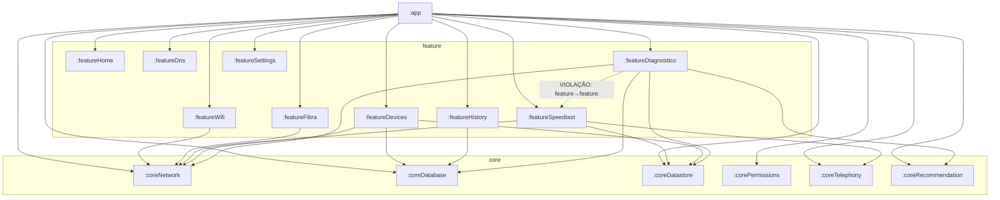

# Arquitetura — SignallQ (visão de sistema)

- **Status:** ativo
- **Última validação:** 2026-07-16
- **Fonte de verdade:** código real (`android/settings.gradle.kts`, `build.gradle.kts` de cada
  módulo) — em caso de divergência com este documento, vale o código (ver
  `.claude/rules/higiene-e-padronizacao-repositorio.md`, seção 3, "Precedência de fontes técnicas")
- **Escopo:** app Android SignallQ (monorepo `7ALabs/linka-android`) — os 16 módulos Gradle, seus
  contratos entre si, e as integrações externas que o app consome
- **Responsável:** Claudete (dono do processo de documentação viva), squad SignallQ
  (Camilo/Lia/Rhodolfo/Juninho) aplica e mantém
- **Documentos por módulo:** `docs_ai/ARQUITETURA/MODULOS/<nome>.md` — um por módulo Gradle real

---

## 1. Visão de contexto do sistema

O SignallQ é um app Android de diagnóstico de conectividade. O usuário roda testes locais (Wi-Fi,
velocidade, DNS, sinal móvel, fibra) e opcionalmente uma análise assistida por IA; o app persiste
histórico localmente e observa a rede em background para alertar sobre degradação.

```
┌─────────────────────────────────────────────────────────────┐
│                      Dispositivo Android                     │
│  ┌───────────────────────────────────────────────────────┐  │
│  │  App SignallQ (io.signallq.app)                        │  │
│  │  UI (Compose) → MainViewModel → Serviços/Engines/Repos  │  │
│  │  Room (SQLite) · DataStore · WorkManager · Hilt DI      │  │
│  └───────────┬─────────────────────────────┬───────────────┘  │
│              │ HTTP                        │ APIs do SO       │
└──────────────┼──────────────────────────────┼──────────────────┘
               ▼                              ▼
    ┌──────────────────────┐      ConnectivityManager · WifiManager
    │  Cloudflare Workers   │      TelephonyManager · NetworkInterface
    │  - linka-ai-diagnosis │      (Wi-Fi vizinho, sinal móvel, ARP/mDNS)
    │    -worker (IA)       │
    │  - signallq-diagnostic│
    │    (motor remoto +    │      Modem GPON Nokia (HTTP local, LAN)
    │    diretório provedor)│
    │  - signallq-admin     │      Google Play (avaliação nativa, Ads/UMP)
    │    (ingest métricas)  │
    │  - game-latency-probe │
    └──────────┬────────────┘
               ▼
    ┌──────────────────────┐
    │  Gemini 2.0 Flash     │  (primário, com GEMINI_API_KEY)
    │  Qwen3 30B MoE FP8    │  (fallback Cloudflare Workers AI)
    └──────────────────────┘

    Firebase (projeto signallq-app): Analytics, Crashlytics, Remote Config,
    App Distribution — fora do fluxo de diagnóstico, mas integrado ao :app.
```

## 2. Componentes principais

### 2.1 App Android (16 módulos Gradle)

| Camada | Módulos | Papel |
|---|---|---|
| `:app` | 1 | composição, navegação, DI de aplicação, `MainViewModel` (único ViewModel raiz) |
| `core/*` | 6 | infraestrutura compartilhada e contratos normalizados |
| `feature/*` | 9 | domínio de cada funcionalidade (estado, casos de uso, componentes exclusivos) |

Ver seção 5 da regra de higiene (`.claude/rules/higiene-e-padronizacao-repositorio.md`) para a
convenção completa de responsabilidade de módulo — não duplicada aqui.

### 2.2 Cloudflare Workers (`integrations/cloudflare/`)

| Worker | Consumido por | Função |
|---|---|---|
| `linka-ai-diagnosis-worker` | `:featureDiagnostico` (`AiDiagnosisRepository`) | Análise LLM de diagnóstico (Gemini 2.0 Flash primário, Qwen3 fallback) |
| `signallq-diagnostic` | `:featureDiagnostico` (`BuildConfig.DIAGNOSTIC_WORKER_URL`) | Motor de diagnóstico remoto + diretório de provedores (logo de operadora) |
| `signallq-admin-worker` | `:app` (`BuildConfig.ADMIN_INGEST_URL`) | Ingest de métricas para o SignallQ Console |
| `game-latency-probe-worker` | `:app` (`BuildConfig.GAME_LATENCY_PROBE_URL`) | Sonda regional TCP/HTTPS para a tela Jogos |

### 2.3 Firebase (projeto `signallq-app`)

Analytics (events), Crashlytics (error logs), Remote Config, App Distribution (canal de release
debug/release). Não usa Realtime Database.

## 3. Fluxo de dados de alto nível

```
UI (Composables)
    ↑ StateFlow.collectAsStateWithLifecycle()
MainViewModel (@HiltViewModel — único ViewModel raiz, em :app)
    ↑ dependências injetadas via Hilt (AppModule)
Serviços / Repositórios / Engines / Use Cases (core/* e feature/*)
    ↑ Room / DataStore / ConnectivityManager / TelephonyManager / WifiManager / OkHttp
```

Fluxo unidirecional: evento da UI → função no `MainViewModel` → atualiza `StateFlow` → recomposição
da UI. Cada `StateFlow` é criado no `MainViewModel` e coletado individualmente por tela — não há
estado global de UI.

Principais streams (detalhe em `docs_ai/ARQUITETURA/MODULOS/app.md`):

```
MonitorRedeAndroid (:coreNetwork)      → snapshotRede        → HomeScreen, SpeedTestScreen, SinalScreen
ExecutorSpeedtest (:featureSpeedtest)  → snapshotSpeedtest    → VelocidadeScreen, ResultadoVelocidadeScreen
DiagnosticOrchestrator (:featureDiagnostico) → snapshotDiagnostico → diagnóstico inline em ResultadoVelocidadeScreen
```

> Correção (2026-07-16): `DiagnosticoScreen`, `ChatScreen`/`LLMChatScreen` citadas em versões
> anteriores deste documento não existem mais no código (confirmado por busca em
> `android/app/src/main/kotlin/`) — o diagnóstico assistido por IA hoje é inline em
> `ResultadoVelocidadeScreen` via `AnalisadorEntryRow`/`AnaliseDetalhadaBottomSheet` (turno único,
> sem chat contínuo). Ver `docs_ai/FUNCIONAL.md` seção 4.2 para o fluxo completo.

## 4. Diagrama de dependências entre módulos

Gerado a partir dos `implementation(project(":..."))` reais em cada `build.gradle.kts` (validado em
2026-07-16). Módulos sem seta de saída não dependem de nenhum outro módulo do monorepo.



**Nota sobre a aresta pontilhada:** `:featureDiagnostico` declara
`implementation(project(":featureSpeedtest"))` — dependência direta de feature para feature, o que
contraria a regra 4.5 da regra de higiene ("Features não podem depender diretamente de outras
features"). Registrado como dívida real, não corrigido nesta tarefa (documentação read-only). Ver
seção 7.

## 5. Navegação

`AppShell.kt` (em `:app`) gerencia o índice da aba selecionada via estado, sem Navigation Component
com rotas por URI para a navegação principal. 5 abas: Início, Velocidade, Sinal, Histórico,
**Ferramentas** (substituiu a antiga aba Ajustes — ver correção abaixo). Fluxos secundários
(Diagnóstico/IA inline, Dispositivos, Fibra/Equipamento de Internet, Laudo, Ping, DNS, Jogos,
Perfil, Privacidade, Novidades, Onboarding) são overlays via `AnimatedVisibility`, controlados pela
pilha `overlayStack`/estado booleano no `MainViewModel` — não são rotas de navigation separadas.

> Correção (2026-07-16): a 5ª aba real é **Ferramentas** (hub de atalhos), não "Ajustes" — Ajustes
> virou o overlay "Perfil", acessado pelo avatar no TopBar de qualquer aba (GH#930/#936). Ver
> `docs_ai/FUNCIONAL.md` seção 2 para o detalhe completo de navegação, overlays e sheets.

## 6. Persistência

| Mecanismo | Módulo | Uso |
|---|---|---|
| Room (SQLite) — `SignallQDatabase` v13 | `:coreDatabase` | Medições, apelidos de dispositivos, sessões/mensagens de chat — ver `docs_ai/TECNICO.md` seção 8.1 para a história dos 3 nomes de banco (Linka/Veloo/SignallQ) |
| DataStore (Preferences) — `linkaPreferencias` | `:coreDatastore` | Preferências do usuário |

## 7. Integrações externas

- **Cloudflare Workers** — ver seção 2.2.
- **Firebase** — Analytics, Crashlytics, Remote Config, App Distribution (projeto `signallq-app`).
- **Google Play** — avaliação nativa (`libs.play.review`), Google Mobile Ads SDK + UMP
  (monetização nativa, gate de consentimento obrigatório).
- **Modem GPON Nokia** — acesso HTTP direto na rede local (`:featureFibra`), sem passar por
  backend próprio.

## 8. Decisões e riscos arquiteturais atuais

- **Dívida de caminho físico `io/veloo` vs. package `io.signallq.app`** — 460 arquivos `.kt` ainda
  residem fisicamente em `io/veloo/app/kotlin/...` apesar de declararem
  `package io.signallq.app...`, em 15 dos 16 módulos (só `:coreRecommendation` já nasceu no caminho
  correto). Ver `.claude/rules/higiene-e-padronizacao-repositorio.md`, seção 4.1, para escopo
  completo e por que não deve ser corrigido oportunisticamente.
- **Violação real de dependência feature→feature** — `:featureDiagnostico` depende diretamente de
  `:featureSpeedtest` (seção 4 acima). Contraria a regra 4.5 da mesma regra de higiene. Ver seção 7
  da resposta final para recomendação.
- **`MainViewModel.kt` (2186 linhas) e `AppShell.kt` (1140 linhas)** — acima do limiar de "dívida
  crítica" (seção 7 da regra de higiene). Ver `docs_ai/ARQUITETURA/MODULOS/app.md`.
- **`:coreRecommendation`** — engine pronta (issue #790) mas ainda não integrada a nenhuma
  feature/UI nem a monetização real (AdMob/afiliados). Não confundir com o motor de recomendações
  de `:featureDiagnostico` (12 dicas práticas do diagnóstico local, sem catálogo/monetização).
- **Aliases Gradle legados** (`:coreNetwork` em vez de `:core:network`) — migração desejada mas não
  executada; ver regra de higiene seção 5.
```

