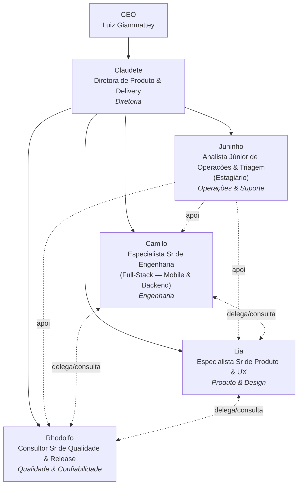

# Estrutura Organizacional do Squad — revisão 2026-07-16

Decisão da Claudete a partir de pedido do Luiz: tratar o squad de agentes como empresa — cargos em
português (padrão TIM/Accenture: Analista → Consultor → Consultor Sr → Especialista → Especialista
Sr → Gerente → Executivo → Diretor), com formação, descrição de cargo, características
profissionais/técnicas, personalidade, atribuições, effort e model por agente. Todos devem ser
proativos e poder delegar entre si. Revisão de skills incluída no mesmo pedido.

## Estrutura de cargos

| Agente | Cargo | Área | Reporta a | Model / Effort padrão |
|---|---|---|---|---|
| Claudete | Diretora de Produto & Delivery | Diretoria | CEO (Luiz) | Sonnet / médio |
| Camilo | Especialista Sr de Engenharia (Full-Stack — Mobile & Backend) | Engenharia | Claudete | Sonnet / alto |
| Lia | Especialista Sr de Produto & UX | Produto & Design | Claudete | Híbrida: Haiku/Sonnet |
| Rhodolfo | Consultor Sr de Qualidade & Release | Qualidade & Confiabilidade | Claudete | Haiku / médio (escala p/ Sonnet) |
| Juninho | Analista Júnior de Operações & Triagem (Estagiário) | Operações & Suporte (compartilhado) | Claudete | Haiku / baixo |

Perfil completo (formação, descrição do cargo, características profissionais e técnicas) em cada
`.claude/agents/<nome>.md`, seção **Perfil Corporativo** — não duplicado aqui de propósito, pra não
ter duas fontes da verdade divergindo com o tempo.

### Por que essa distribuição

- **Camilo e Lia em Especialista Sr:** os dois ICs mais seniores do squad — Camilo por amplitude
  técnica (3 stacks: Kotlin/Compose, React/TS, Cloudflare Workers, mais debugging de toolchain),
  Lia por profundidade de julgamento (achou um bug real de dado fake em produção que ninguém mais
  tinha visto, revisão 2026-07-15 da PR #950).
- **Rhodolfo em Consultor Sr, não Especialista:** sua função é auditoria/gate — não implementa, só
  verifica e emite veredito com evidência. Isso mapeia melhor pro padrão "Consultor" (função de
  compliance/qualidade externa ao time de execução) do que pro padrão "Especialista" (IC que
  constrói).
- **Juninho como Analista Júnior, Área compartilhada:** ele não pertence a uma área fim — apoia as
  outras quatro (triagem pro Camilo, verificação de deploy antes do Rhodolfo revisar, etc.). Área
  "Operações & Suporte" reflete isso, reportando à Claudete por ser quem calibra prioridade e
  pontuação das tarefas dele.

### Delegação — todos proativos, todos podem acionar uns aos outros

Claudete, Camilo, Lia e Rhodolfo já tinham essa capacidade habilitada desde 2026-07-11
("Delegação entre pares"). **Juninho ganhou a tool `Agent` em 2026-07-16**, mas com restrição
deliberada: só pode fazer 1 chamada de handoff (escalar pra cima, pro agente certo, quando o
achado exige julgamento) — nunca orquestrar fan-out ou encadear múltiplas chamadas. Isso preserva o
motivo dele existir (trabalho barato antes do caro) e ainda assim cumpre "todos devem poder
delegar".

## Auditoria de skills

### O que existe hoje

15 skills de projeto em `.claude/skills/` antes desta revisão, mais 10 skills globais do usuário
(compartilhadas entre projetos: `checar-entrega`, `higiene`, `issue-conventions`,
`protocolo-play-store`, `refinar-demanda`, `revisar-ux`, mais `ios-deploy`/`ios-ferramentas`/
`ios-plataforma`/`landing-startup` — esses 4 últimos são globais e não têm relação com o SignallQ,
que é 100% Android/web; não removidos por não serem escopo deste repo, só sinalizados como não
aplicáveis).

### Achados e correções

1. **Mirrors dessincronizados — corrigido.** `.agents/skills/` (mirror pro Codex) estava faltando
   `cloudflare-d1-console` e `reconhecimento-equipamento-rede`. `.github/skills/` (mirror pros
   hooks do GitHub) estava com só 2 das 15 skills — 13 faltando. Ambos resincronizados a partir de
   `.claude/skills/`, que é a fonte canônica (regra já existente no `CLAUDE.md`, só não estava
   sendo seguida à risca).
2. **Juninho sem "Skills recomendadas" — corrigido.** Era o único dos 5 agentes sem essa seção,
   apesar de fazer triagem (se beneficia de `/issue-conventions`) e higiene mecânica leve (se
   beneficia de `/higiene`). Adicionado.
3. **Gap real identificado — skill nova criada: `/protocolo-ci-android`.** Nenhuma skill cobria os
   dois achados técnicos concretos da sessão de 2026-07-15 (dependabot preso em `action_required`
   mascarando CI não validado; mismatch `kapt`/`kotlin-metadata-jvm` ao bumpar
   `kotlin.plugin.compose`) nem a decisão de `strict=false`. `/protocolo-ktlint` existente é
   escopo diferente (só suppressão de regra Ktlint). Criada e referenciada em Camilo e Rhodolfo
   (os dois que lidam com CI/dependência).
4. **Sem mescla necessária dentro do projeto.** As skills `linka`/`linka-arch`/`linka-docs`
   mencionadas em decisões antigas do `CLAUDE.md` não existem mais em `.claude/skills/` — a
   migração pra `SignallQ-design`/`arquitetura-android`/`gerar-docs` já está completa, não há
   duplicata ativa pra mesclar.
5. **Atribuição por agente conferida** — cada skill de projeto já estava referenciada por pelo
   menos um agente coerente com o domínio dela (ex: `cloudflare-d1-console` em Camilo e Lia,
   `reconhecimento-equipamento-rede` só em Camilo). Nenhuma reatribuição necessária além do item 3.

## Organograma

Linhas cheias = reporte hierárquico. Linhas pontilhadas = apoio/delegação lateral (todos os 5 podem
se acionar diretamente; Juninho só escala pra cima, não delega lateralmente).

## Referência

Parte 1 (disciplina de PR/branch) e Parte 2 (efetividade de dispatch) em
`docs_ai/operations/PROCESSO_PR_E_AGENTES_2026-07-16.md`. Perfis completos em `.claude/agents/`.
