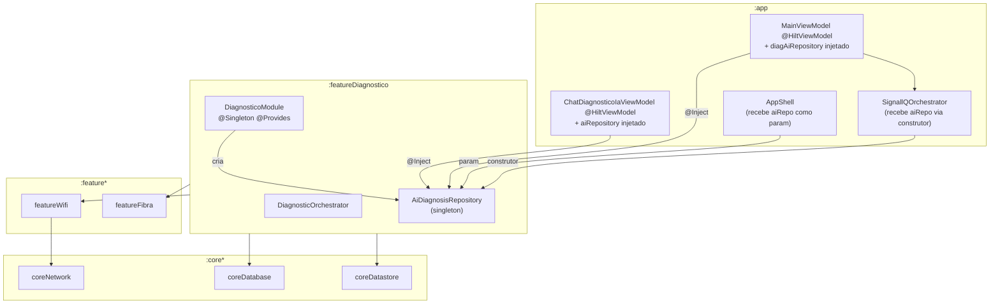
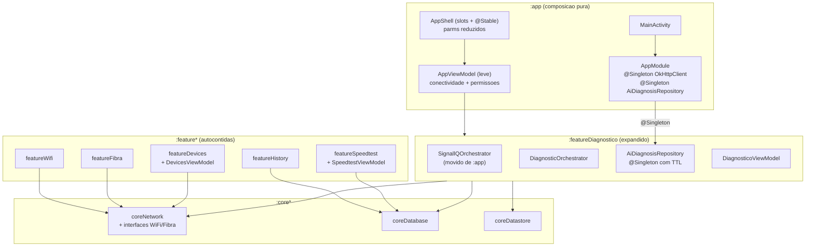

# Migracao de Arquitetura SignallQ — Junho 2026

> **Tipo:** Relatório de migração  
> **Data:** 2026-06-21  
> **Versao auditada:** 0.16.0 (versionCode 46)  
> **Fontes:** `docs/ARCHITECTURE_REVIEW.md`, `docs_ai/technical/migrations/repositorio-ia-hilt-singleton.md`, git log main  
> **Status:** Passo 1 consolidado; Passos 2-7 planejados

---

## Situacao anterior (problemas resolvidos)

A auditoria de arquitetura (2026-06-21, `docs/ARCHITECTURE_REVIEW.md`) identificou quatro categorias de problema de severidade alta e seis de severidade media, distribuídos em tres lentes: performance, energia e clean architecture.

### Problemas de alta severidade (origem)

**1. `AiDiagnosisRepository` instanciada em cinco pontos distintos sem DI centralizado**

O repositório de IA era criado independentemente em:
- `MainViewModel` — lazy delegate
- `SignallQOrchestrator` — campo privado no construtor
- `ChatDiagnosticoIaViewModel` — lazy delegate
- `AppShell` (Composable) — `remember { ... }`
- `DiagnosticoScreen` (Composable) — `remember { ... }`

Consequencia direta: dois caches `ConcurrentHashMap` desconexos. Diagnóstico idêntico solicitado por dois caminhos retornava resposta duplicada do Cloudflare Worker (cache miss na segunda instância), dobrando latência e consumo de tokens. URL do worker hardcoded em quatro arquivos diferentes.

**2. `SignallQOrchestrator` (976 linhas) vivendo em `:app/pulse/`**

Lógica de negócio de alto nível — fluxo de speedtest, diagnóstico, IA e perguntas dinâmicas — dentro do módulo `:app`, que deve ser exclusivamente de composição DI e navegação. Código de domínio não testável em isolamento.

**3. `MainViewModel` (1602 linhas) como God ViewModel**

Importava todos os 14 módulos (linhas 21-55) e instanciava `DiagnosticOrchestrator`, `SignallQOrchestrator`, `AvaliadorCoerenciaDns` e `AiDiagnosisRepository` via `lazy {}` fora do grafo Hilt. ViewModel não testável sem inicializar 14 módulos.

**4. Dependencias cruzadas entre features (`featureDiagnostico → featureWifi`, `featureDiagnostico → featureFibra`)**

`featureDiagnostico/build.gradle.kts:31-32` declarava dependências de projeto para dois módulos de mesmo nível (peers). Não era possível construir, testar ou reusar `featureDiagnostico` sem compilar também `featureWifi` e `featureFibra`. Qualquer mudança de API em `featureWifi` quebrava `featureDiagnostico`.

### Problemas de media severidade (origem)

| Problema | Arquivo | Impacto |
|---|---|---|
| `checkAvailability()` criava novo `OkHttpClient` a cada chamada | `AiDiagnosisRepository.kt:71-74` | +200-500ms por verificação (novo TCP handshake + TLS) |
| Tres pools HTTP independentes em paralelo | `ScannerDispositivosAndroid.kt`, `UpnpIgdDiscovery.kt`, `AiDiagnosisRepository.kt` | Seis ou mais conexoes TCP simultâneas para o mesmo gateway |
| `AppShell` com 40+ parametros | `AppShell.kt:127-220` | Mudança de sinal Wi-Fi disparava recomposição de toda a arvore |
| Cache IA sem TTL | `AiDiagnosisRepository.kt:60,102-103` | Troca de rede retornava diagnóstico do estado anterior |
| `MulticastLock` sem guard em race condition | `ScannerDispositivosAndroid.kt:418-420` | Lock multicast podia ficar adquirido sem release em scan cancelado |
| Telas Composable monolíticas (HomeScreen 3487L, SinalScreen 2998L) | Screens em `:app` | Skip de recomposição inibido; complexidade futura elevada |

---

## O que foi feito (7 passos)

O plano de migração incremental foi definido em `docs/ARCHITECTURE_REVIEW.md:Seção 4`. Cada passo tem PR verificavel independente. A sequencia vai do mais seguro ao mais estrutural.

### Passo 1 — Unificar `AiDiagnosisRepository` no Hilt como Singleton (CONSOLIDADO)

**Commits:** `0dc42bc`, `b20c140`, `2a9fd38`, `317b60b`, `10e808c`, `f4be84e`, `b36def4`, `da29209`, `47e8717`

**O que mudou:**

| Arquivo | Alteracao |
|---|---|
| `featureDiagnostico/build.gradle.kts` | Plugins `kotlin-kapt` e `dagger.hilt.android.plugin`; `buildConfig = true`; campo `AI_WORKER_URL` por buildType |
| `featureDiagnostico/src/.../di/DiagnosticoModule.kt` | NOVO — `@Module @InstallIn(SingletonComponent::class)` com `@Provides @Singleton` |
| `featureDiagnostico/src/.../ai/AiDiagnosisRepository.kt` | Bloco `init` com `Log.d(hashCode)` protegido por `runCatching` para validação de singleton em device |
| `app/src/.../pulse/SignallQOrchestrator.kt` | Repositório recebido via construtor; `AI_BASE_URL` hardcoded removida |
| `app/src/.../MainViewModel.kt` | `@HiltViewModel @Inject constructor(val diagAiRepository: AiDiagnosisRepository)` |
| `app/src/.../ui/viewmodel/ChatDiagnosticoIaViewModel.kt` | `@HiltViewModel @Inject constructor(val aiRepository: AiDiagnosisRepository)` |
| `app/src/.../ui/screen/DiagnosticoScreen.kt` | Repositório como parametro Composable; `remember { ... }` removido |
| `app/src/.../ui/screen/AppShell.kt` | Repositório como parametro; instanciação via `remember` removida |
| `app/src/.../MainActivity.kt` | Passa `mainViewModel.diagAiRepository` para AppShell |

**Resultado:** Uma única instância gerenciada pelo Hilt. URL centralizada em `BuildConfig.AI_WORKER_URL`. Fluxo de injeção: `DiagnosticoModule → SingletonComponent → MainViewModel → AppShell → DiagnosticoScreen`.

**Validação executada:** `Log.d("AiDiagnosisRepository", "hashCode: ${identityHashCode}")` no `init` confirma mesmo hash em todos os pontos de consumo.

---

### Passo 2 — Unificar `OkHttpClient` UPnP/scan como Singleton (PLANEJADO)

**O que muda:**
- `AppModule.kt`: `@Provides @Singleton fun provideOkHttpClient(): OkHttpClient`
- `ScannerDispositivosAndroid.kt:91-97`: remover `okHttpClient by lazy`; receber por construtor
- `UpnpIgdDiscovery.kt:17-21`: remover instância local; receber por construtor
- `AiDiagnosisRepository` mantém cliente próprio (readTimeout 90s — específico para IA; não compartilhado com UPnP/1.5s)

**Risco:** Baixo.

---

### Passo 3 — Adicionar TTL ao cache de IA (PLANEJADO)

**O que muda:**
- `ConcurrentHashMap<String, AiDiagnosisResult>` → `ConcurrentHashMap<String, Pair<AiDiagnosisResult, Long>>`
- Invalidação de entradas com mais de 5 minutos na consulta

**Risco:** Mínimo.

---

### Passo 4 — Mover `SignallQOrchestrator` para `featureDiagnostico` (PLANEJADO)

**O que muda:**
- Mover `app/src/.../pulse/SignallQOrchestrator.kt` → `featureDiagnostico/src/.../pulse/SignallQOrchestrator.kt`
- `featureDiagnostico/build.gradle.kts` já tem `coreNetwork` e `coreDatabase`
- Pendencia: extrair interface `ExecutorSpeedtest` para módulo core acessível por ambos (`featureSpeedtest` implementa; `featureDiagnostico` consome interface)

**Risco:** Médio.

---

### Passo 5 — Remover dependencias cruzadas `featureDiagnostico → featureWifi/featureFibra` (PLANEJADO)

**O que muda:**
- Identificar símbolos importados de `featureWifi` e `featureFibra` em `featureDiagnostico` (tipos: `EstadoFibra`, resultado de topologia Wi-Fi)
- Mover esses contratos para `coreNetwork` ou novo módulo `coreContracts`
- `featureWifi` e `featureFibra` implementam e retornam esses tipos; `featureDiagnostico` importa de `coreContracts`
- Remover `featureDiagnostico/build.gradle.kts:31-32`

**Risco:** Médio-alto. Requer mover data classes sem quebrar consumidores.

---

### Passo 6 — Quebrar `MainViewModel` em ViewModels por feature (PLANEJADO)

**O que muda:**
- Extrair `DevicesViewModel` — scan de dispositivos, apelidos
- Extrair `SpeedtestViewModel` — execução, persistência
- Extrair `DiagnosticoViewModel` — orquestrador, chat IA, diagnóstico
- `MainViewModel` → `AppViewModel` leve: conectividade, permissões, navegação de tabs

**Estratégia de mitigação:** feature a feature, começando por `DevicesViewModel` (mais isolado). `DiagnosticoViewModel` por último.

**Risco:** Alto. Requer refactor de `AppShell` para coletar de múltiplos ViewModels.

---

### Passo 7 — Decomposicao progressiva das telas Composable (PLANEJADO, PARALELO)

**O que muda:**
- `HomeScreen.kt` (3487L): extrair cada card/seção em `@Composable` privada com parâmetros mínimos
- `SinalScreen.kt` (2998L): idem
- `AjustesScreen.kt` (2323L): idem
- `AppShell.kt` (1053L): agrupar parâmetros em data classes `@Stable` por domínio

Nenhuma lógica de negócio movida neste passo — apenas decomposição visual.

**Risco:** Baixo por função. Pode ser feito em PRs separados por tela.

---

## Métricas de melhoria

### Passo 1 (realizado)

| Métrica | Antes | Depois |
|---|---|---|
| Instâncias de `AiDiagnosisRepository` em runtime | 5 (duas ativas simultâneas: MainViewModel + Orchestrator) | 1 (Hilt singleton) |
| Caches `ConcurrentHashMap` independentes para IA | 2 desconexos | 1 único |
| Arquivos com URL do worker hardcoded | 4 | 0 (centralizado em `BuildConfig.AI_WORKER_URL`) |
| Instanciação de repositório em Composables | 2 (`AppShell`, `DiagnosticoScreen` via `remember`) | 0 |
| Pontos de mock necessários para testar fluxo IA | 5 (um por instância) | 1 |

### Projecao pós Passos 2-7 (estimativa)

| Métrica | Atual (pós P1) | Alvo (pós P7) |
|---|---|---|
| Pools `OkHttpClient` simultâneos | 3 | 2 (scan/UPnP unificado; IA separado por timeout) |
| Linhas em `MainViewModel` | ~1602 | ~400 (AppViewModel leve) |
| Linhas em `AppShell` | ~1053 (40+ params) | ~400 (slots + data classes @Stable) |
| Dependencias cruzadas entre features | 2 (`featureDiagnostico → featureWifi/featureFibra`) | 0 |
| Maior Composable (HomeScreen) | 3487L | <1000L por decomposição em sub-composables |
| ViewModels testáveis em isolamento | 0 de 2 (MainViewModel, ChatDiagnosticoIaViewModel) | 4 de 4 (AppVM, DevicesVM, SpeedtestVM, DiagnosticoVM) |

---

## Arquitetura resultante

### Estado atual (pós Passo 1)

Estrutura de 15 módulos Gradle mantida intacta. A mudança do Passo 1 incide exclusivamente na camada de DI e instanciação.

```
:app
  MainActivity
  AppShell (40+ params — ainda a refatorar)
  MainViewModel @HiltViewModel
    diagAiRepository: AiDiagnosisRepository  ← singleton injetado
    SignallQOrchestrator(aiRepository)        ← recebe singleton via construtor
  ChatDiagnosticoIaViewModel @HiltViewModel
    aiRepository: AiDiagnosisRepository      ← singleton injetado

:featureDiagnostico
  di/DiagnosticoModule                       ← NOVO: fonte única de AiDiagnosisRepository
    @Provides @Singleton provideAiDiagnosisRepository()
      baseUrl = BuildConfig.AI_WORKER_URL    ← URL centralizada
  ai/AiDiagnosisRepository
    cache: ConcurrentHashMap (sem TTL — alvo do Passo 3)
  DiagnosticOrchestrator
  + dependencias: featureWifi, featureFibra  ← ainda presentes, alvo do Passo 5
```

### Diagrama de dependencias (estado atual)



### Arquitetura alvo (pós Passos 2-7)



---

## Proximos passos sugeridos

Ordenados por impacto e risco crescente. Os passos 2 e 3 podem ser executados em paralelo ou em qualquer ordem entre si.

| Ordem | Passo | Risco | Criterio de conclusao |
|---|---|---|---|
| 1 | P2 — `OkHttpClient` singleton para UPnP/scan | Baixo | Scan de dispositivos e topologia funcionando; logs de conexao mostram reutilizacao |
| 2 | P3 — TTL de 5 min no cache de IA | Mínimo | Diagnóstico após troca de rede retorna resultado novo |
| 3 | P4 — Mover `SignallQOrchestrator` para `featureDiagnostico` | Médio | `assembleDebug` + `./gradlew test` passam |
| 4 | P5 — Remover deps cruzadas `featureDiagnostico → featureWifi/featureFibra` | Médio-alto | `./gradlew :featureDiagnostico:test :featureWifi:test :featureFibra:test` passam |
| 5 | P6 — Quebrar `MainViewModel` em VMs por feature | Alto | Cada VM extraído tem testes de unidade; comportamento visual idêntico |
| 6 | P7 — Decomposição de telas Composable | Baixo | UI visual idêntica antes/depois; executável em paralelo com qualquer outro passo |

**Dependencias entre passos:**
- P4 deve preceder P5 (com `SignallQOrchestrator` em `featureDiagnostico`, a remoção de deps cruzadas é mais clara)
- P5 deve preceder P6 (com features desacopladas, a divisão de `MainViewModel` tem menos risco de regressão cruzada)
- P7 é independente de todos — pode ser feito a qualquer momento, PR por PR, tela por tela

**Atencao tecnica pendente:**

Para o Passo 4, `SignallQOrchestrator` importa `ExecutorSpeedtest` de `featureSpeedtest`. Antes de mover o orquestrador para `featureDiagnostico`, é necessário extrair a interface `IExecutorSpeedtest` para `coreNetwork` ou módulo core equivalente. Sem isso, `featureDiagnostico` passa a depender de `featureSpeedtest` — trocando uma dependencia cruzada por outra.

---

## Referencias

- `docs/ARCHITECTURE_REVIEW.md` — auditoria completa antes/depois, diagramas, tabela de mapeamento
- `docs_ai/technical/migrations/repositorio-ia-hilt-singleton.md` — detalhe do Passo 1 executado
- Git log main: commits `0dc42bc` a `47e8717` — evidencia de implementacao do Passo 1
