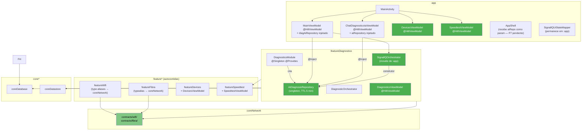
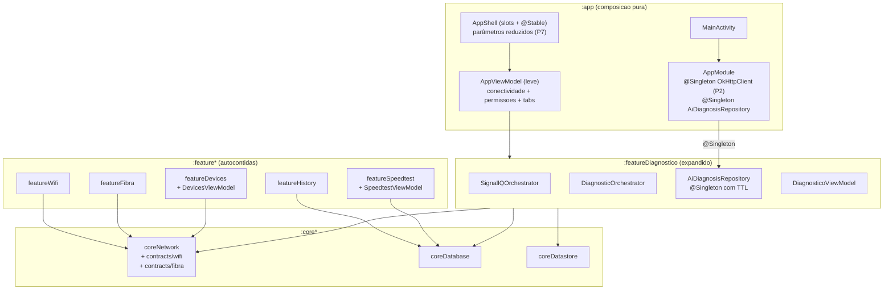

# Migração de Arquitetura SignallQ — Junho 2026

> **DOCUMENTO HISTÓRICO** — reflete o estado em 2026-06-21 (v0.16.0). Para o estado atual, ver `docs_ai/technical/ARCHITECTURE.md`.

> **Tipo:** Relatório de migração — consolidado  
> **Data:** 2026-06-21  
> **Versão:** 0.16.0 (versionCode 46)  
> **Fontes:** `docs/ARCHITECTURE_REVIEW.md`, `docs_ai/technical/migrations/`, git log main  
> **Público-alvo:** Humano (engenharia, produto)  
> **Status:** Passos 1, 3, 4, 5 e 6 (parcial) concluídos e mergeados em main. Passos 2 e 7 planejados.

---

## Situação anterior (problemas resolvidos)

A auditoria de arquitetura (`docs/ARCHITECTURE_REVIEW.md`, 2026-06-21) identificou quatro problemas de severidade alta e seis de severidade média, distribuídos em três lentes: performance, energia e clean architecture.

### Problemas de alta severidade

**1. `AiDiagnosisRepository` instanciada em cinco pontos distintos sem DI centralizado**

O repositório de IA era criado independentemente em `MainViewModel` (lazy delegate), `SignallQOrchestrator` (campo privado no construtor), `ChatDiagnosticoIaViewModel` (lazy delegate), `AppShell` (Composable via `remember`) e `DiagnosticoScreen` (Composable via `remember`). Resultado: dois caches `ConcurrentHashMap` desconexos — diagnóstico idêntico por dois caminhos retornava resposta duplicada do Cloudflare Worker, dobrando latência e consumo de tokens. URL do worker hardcoded em quatro arquivos diferentes.

**2. `SignallQOrchestrator` (976 linhas) vivendo em `:app/pulse/`**

Lógica de negócio de alto nível — fluxo de speedtest, diagnóstico, IA e perguntas dinâmicas — dentro do módulo `:app`, que deve ser exclusivamente de composição DI e navegação. Código de domínio não testável em isolamento.

**3. `MainViewModel` (1602 linhas) como God ViewModel**

Importava todos os 14 módulos e instanciava `DiagnosticOrchestrator`, `SignallQOrchestrator`, `AvaliadorCoerenciaDns` e `AiDiagnosisRepository` via `lazy {}` fora do grafo Hilt. ViewModel não testável sem inicializar 14 módulos.

**4. Dependências cruzadas entre features (`featureDiagnostico → featureWifi`, `featureDiagnostico → featureFibra`)**

`featureDiagnostico/build.gradle.kts` declarava dependências de projeto para dois módulos de mesmo nível (peers). Não era possível construir, testar ou reusar `featureDiagnostico` sem compilar também `featureWifi` e `featureFibra`. Qualquer mudança de API em `featureWifi` quebrava `featureDiagnostico`.

### Problemas de média severidade

| Problema | Arquivo | Impacto |
|---|---|---|
| `checkAvailability()` criava novo `OkHttpClient` a cada chamada | `AiDiagnosisRepository.kt:71-74` | +200-500ms por verificação (novo TCP handshake + TLS) |
| Tres pools HTTP independentes em paralelo | `ScannerDispositivosAndroid.kt`, `UpnpIgdDiscovery.kt`, `AiDiagnosisRepository.kt` | Seis ou mais conexões TCP simultâneas para o mesmo gateway |
| `AppShell` com 40+ parâmetros | `AppShell.kt:127-220` | Mudança de sinal Wi-Fi disparava recomposição de toda a árvore |
| Cache de IA sem TTL | `AiDiagnosisRepository.kt:60,102-103` | Troca de rede retornava diagnóstico do estado anterior |
| `MulticastLock` sem guard em race condition | `ScannerDispositivosAndroid.kt:418-420` | Lock multicast podia ficar adquirido sem release em scan cancelado |
| Telas Composable monolíticas (HomeScreen 3487L, SinalScreen 2998L) | Screens em `:app` | Skip de recomposição inibido; complexidade futura elevada |

---

## O que foi feito (7 passos)

O plano de migração incremental foi definido em `docs/ARCHITECTURE_REVIEW.md`, Seção 4. A ordem vai do mais seguro ao mais estrutural. Cada passo tem PR verificável independente.

---

### Passo 1 — Unificar `AiDiagnosisRepository` no Hilt como Singleton — CONCLUIDO

**Commits:** `0dc42bc`, `b20c140`, `2a9fd38`, `317b60b`, `10e808c`, `f4be84e`, `b36def4`, `da29209`, `47e8717`

**O que mudou:**

| Arquivo | Alteração |
|---|---|
| `featureDiagnostico/build.gradle.kts` | Plugins `kotlin-kapt` e `dagger.hilt.android.plugin`; `buildConfig = true`; campo `AI_WORKER_URL` por buildType |
| `featureDiagnostico/src/.../di/DiagnosticoModule.kt` | NOVO — `@Module @InstallIn(SingletonComponent::class)` com `@Provides @Singleton` |
| `featureDiagnostico/src/.../ai/AiDiagnosisRepository.kt` | Bloco `init` com `Log.d(hashCode)` protegido por `runCatching` para validação de singleton em device |
| `app/src/.../pulse/SignallQOrchestrator.kt` | Repositório recebido via construtor; `AI_BASE_URL` hardcoded removida |
| `app/src/.../MainViewModel.kt` | `@HiltViewModel @Inject constructor(val diagAiRepository: AiDiagnosisRepository)` |
| `app/src/.../ui/viewmodel/ChatDiagnosticoIaViewModel.kt` | `@HiltViewModel @Inject constructor(val aiRepository: AiDiagnosisRepository)` |
| `app/src/.../ui/screen/DiagnosticoScreen.kt` | Repositório como parâmetro Composable; `remember { ... }` removido |
| `app/src/.../ui/screen/AppShell.kt` | Repositório como parâmetro; instanciação via `remember` removida |
| `app/src/.../MainActivity.kt` | Passa `mainViewModel.diagAiRepository` para AppShell |

**Resultado:** Uma única instância gerenciada pelo Hilt. URL centralizada em `BuildConfig.AI_WORKER_URL`. Fluxo de injeção: `DiagnosticoModule → SingletonComponent → MainViewModel → AppShell → DiagnosticoScreen`.

---

### Passo 2 — Unificar `OkHttpClient` UPnP/scan como Singleton — PLANEJADO

**O que muda:**
- `AppModule.kt`: `@Provides @Singleton fun provideOkHttpClient(): OkHttpClient`
- `ScannerDispositivosAndroid.kt:91-97`: remover `okHttpClient by lazy`; receber por construtor
- `UpnpIgdDiscovery.kt:17-21`: remover instância local; receber por construtor
- `AiDiagnosisRepository` mantém cliente próprio (readTimeout 90s, específico para IA — não compartilhado com UPnP/1.5s)

**Risco:** Baixo. O `OkHttpClient` do `AiDiagnosisRepository` permanece separado (timeouts diferentes); apenas o cliente UPnP/scan é unificado.

---

### Passo 3 — Adicionar TTL de 5 min ao cache de IA — CONCLUIDO

**Commits:** `96f1100` (feature), `ad3b235` (testes TTL), `e10d431` (implementação)

**O que mudou:**

`AiDiagnosisRepository` — `ConcurrentHashMap<String, AiDiagnosisResult>` substituído por `ConcurrentHashMap<String, Pair<AiDiagnosisResult, Long>>`:

- Constante `CACHE_TTL_MS = 5 * 60 * 1000L` adicionada
- Clock injetável (`clock: () -> Long = System::currentTimeMillis`) para testes determinísticos
- Lookup valida se `clock() - timestamp > CACHE_TTL_MS` — entrada expirada é removida e nova requisição é feita
- Inserção armazena `Pair(resultado, clock())`
- `cache` e `cacheKey()` marcados `internal` para testes unitários
- Testes de TTL em `AiDiagnosisRepositoryTest`: cache hit dentro do TTL, cache miss por expiração, clock injetável

**Resultado:** Troca de rede (Wi-Fi → móvel) retorna diagnóstico atualizado após 5 minutos. Testes determinísticos sem `Thread.sleep()`.

---

### Passo 4 — Mover `SignallQOrchestrator` para `featureDiagnostico` — CONCLUIDO

**Commits:** `18a1131` (feature), `a09c5ef` (mover orquestrador), `50d6be4` (deps em featureDiagnostico)

**O que mudou:**

| Arquivo | Tipo | Alteração |
|---|---|---|
| `featureDiagnostico/build.gradle.kts` | Atualização | Adicionadas deps: `coreNetwork`, `featureSpeedtest`, `timber` |
| `featureDiagnostico/src/.../pulse/SignallQOrchestrator.kt` | Novo | Movido de `app/pulse/` com package atualizado para `io.veloo.app.feature.diagnostico.pulse` |
| `app/src/.../MainViewModel.kt` | Atualização | Import corrigido: `io.veloo.app.feature.diagnostico.pulse.SignallQOrchestrator` |
| `app/src/.../pulse/SignallQOrchestrator.kt` | Deletado | Conteúdo migrado para featureDiagnostico |

`SignallQUiStateMapper.kt` permanece em `app/pulse/` — é mapeamento de UI state para Compose, responsabilidade correta do módulo `:app`.

**Resultado:** Lógica de diagnóstico IA concentrada em seu módulo feature. `featureDiagnostico` é agora autocontido (orquestrador + UI + storage). `:app` delimitado a composição DI e navegação.

---

### Passo 5 — Remover dependências cruzadas `featureDiagnostico → featureWifi/featureFibra` — CONCLUIDO

**Commits:** `5599325` (refactor featureDiagnostico), `340e570` (featureWifi/featureFibra type aliases), `ebeae01` (contratos em coreNetwork)

**Estratégia:** Extrair contratos compartilhados para `coreNetwork`. Features continuam expondo a mesma API via type aliases e delegates — consumidores não quebram.

**Contratos criados em `coreNetwork/src/main/kotlin/io/veloo/app/core/network/contracts/`:**

| Arquivo | Conteúdo |
|---|---|
| `wifi/RedeVizinha.kt` | Modelo de rede vizinha (SSID, BSSID, frequência, nível) |
| `wifi/channel/ChannelEvalModels.kt` | Tipos: `Band`, `ChannelWidth`, `ChannelScore`, `EvalConfig` |
| `wifi/channel/ChannelEvaluator.kt` | Função `evaluateChannels(...)` |
| `wifi/channel/FrequencyUtils.kt` | Função `freqToChannel(...)` |
| `wifi/channel/ChannelCandidates.kt` | Constantes de canais e larguras |
| `fibra/GponSaudeStatus.kt` | Modelo de status de saúde GPON |
| `fibra/ClassificadorSaudeGpon.kt` | Função `classificarSaudeGpon(...)` |

**Mudanças por módulo:**
- `featureWifi`: tipos locais convertidos em type aliases; funções em delegates apontando para `coreNetwork`
- `featureFibra`: `GponSaudeStatus` como typealias; dep `coreNetwork` adicionada em `build.gradle.kts`
- `featureDiagnostico`: linhas `:featureWifi` e `:featureFibra` removidas do `build.gradle.kts`; 4 arquivos com imports atualizados (`FibraSignalQualityEngine.kt`, `WifiChannelDiagnosticEngine.kt`, `TopologyDiagnostic.kt`, `MeshDetector.kt`)

**Grafo resultante:**
```
featureDiagnostico → coreNetwork (contratos), coreDatabase, coreDatastore, featureSpeedtest
featureWifi → coreNetwork
featureFibra → coreNetwork
coreNetwork → (zero deps de feature — acíclico)
```

---

### Passo 6 — Quebrar `MainViewModel` em ViewModels por feature — CONCLUIDO (parcial)

**Commits:** `38221e4` (integração), `885b16b` (DI), `8415187` (DevicesViewModel), `3f70681` (SpeedtestViewModel), `d738640` (DiagnosticoViewModel), `921216c` (fix DI), `cd610f0` (fix memory leak)

**O que mudou:**

Três ViewModels extraídos como `@HiltViewModel`, cada um injetando apenas os módulos de que precisa:

| ViewModel | Módulo | Responsabilidade |
|---|---|---|
| `DevicesViewModel` | `featureDevices` | Scan de dispositivos, apelidos, estado de lista |
| `SpeedtestViewModel` | `featureSpeedtest` | Execução de speedtest, persistência de resultados |
| `DiagnosticoViewModel` | `featureDiagnostico` | Orquestrador, chat IA, diagnóstico de rede |

Os três foram integrados em `MainActivity` (`885b16b`, `886b16b`) e memory leaks e código morto corrigidos (`cd610f0`).

**Situação pendente:** `MainViewModel` ainda existe e mantém estado de conectividade, permissões e navegação de tabs — divisão esperada. A extração do `ChatDiagnosticoIaViewModel` e a redução do `MainViewModel` para `AppViewModel` leve são os próximos sub-passos do Passo 6.

---

### Passo 7 — Decomposição progressiva das telas Composable — PLANEJADO (paralelo)

**O que muda:**
- `HomeScreen.kt` (3487L): extrair cada card/seção em `@Composable` privada com parâmetros mínimos
- `SinalScreen.kt` (2998L): idem
- `AjustesScreen.kt` (2323L): idem
- `AppShell.kt` (1053L, 40+ params): agrupar parâmetros em data classes `@Stable` por domínio (ex: `AppShellSpeedtestState`, `AppShellWifiState`)

Nenhuma lógica de negócio movida neste passo — apenas decomposição visual. Pode ser feito em PRs separados por tela, um card de cada vez.

**Risco:** Baixo por função.

---

## Métricas de melhoria

### Passos concluídos (1, 3, 4, 5, 6 parcial)

| Métrica | Antes | Depois |
|---|---|---|
| Instâncias de `AiDiagnosisRepository` em runtime | 5 (duas ativas simultâneas em fluxo padrão) | 1 (Hilt singleton) |
| Caches `ConcurrentHashMap` independentes para IA | 2 desconexos | 1 único com TTL 5 min |
| Arquivos com URL do worker hardcoded | 4 | 0 (`BuildConfig.AI_WORKER_URL`) |
| Instanciação de repositório em Composables | 2 (`AppShell`, `DiagnosticoScreen` via `remember`) | 0 |
| Pontos de mock necessários para testar fluxo IA | 5 | 1 |
| `SignallQOrchestrator` — localização | `:app/pulse/` (código de domínio no módulo errado) | `featureDiagnostico/pulse/` |
| Dependências cruzadas entre features | 2 (`featureDiagnostico → featureWifi`, `featureDiagnostico → featureFibra`) | 0 |
| ViewModels testáveis em isolamento | 0 de 2 (`MainViewModel`, `ChatDiagnosticoIaViewModel`) | 3 de 3 novos (`DevicesViewModel`, `SpeedtestViewModel`, `DiagnosticoViewModel`) |
| Diagnóstico retorna resultado obsoleto após troca de rede | Sim (cache sem TTL) | Não (cache expira em 5 min) |

### Projeção pós Passos 2 e 7 (estimativa)

| Métrica | Atual (pós P1, P3-P6 parcial) | Alvo (pós P2 e P7) |
|---|---|---|
| Pools `OkHttpClient` simultâneos | 3 | 2 (scan/UPnP unificado; IA separado por timeout) |
| Linhas em `MainViewModel` | ~1602 | ~400 (`AppViewModel` leve: conectividade, permissões, tabs) |
| Linhas em `AppShell` | ~1053 (40+ params) | ~400 (slots + data classes `@Stable`) |
| Maior Composable (`HomeScreen`) | 3487L | <1000L por decomposição em sub-composables |

---

## Arquitetura resultante

### Estado atual (pós Passos 1, 3, 4, 5, 6 parcial)

```
:app
  MainActivity
    DevicesViewModel @HiltViewModel
    SpeedtestViewModel @HiltViewModel
    DiagnosticoViewModel @HiltViewModel
    MainViewModel @HiltViewModel
      diagAiRepository: AiDiagnosisRepository  ← singleton injetado
  AppShell (40+ params — ainda a refatorar no P7)
  ChatDiagnosticoIaViewModel @HiltViewModel
    aiRepository: AiDiagnosisRepository        ← singleton injetado
  SignallQUiStateMapper                        ← permanece em :app (UI state mapping)

:featureDiagnostico
  di/DiagnosticoModule                         ← fonte única de AiDiagnosisRepository
    @Provides @Singleton provideAiDiagnosisRepository()
      baseUrl = BuildConfig.AI_WORKER_URL      ← URL centralizada
  pulse/SignallQOrchestrator                   ← movido de :app
  ai/AiDiagnosisRepository
    cache: ConcurrentHashMap com TTL 5 min     ← clock injetável
  DiagnosticOrchestrator
  DiagnosticoViewModel @HiltViewModel
  deps: coreNetwork, coreDatabase, coreDatastore, featureSpeedtest
        (featureWifi e featureFibra REMOVIDOS)

:coreNetwork
  contracts/wifi/                              ← NOVOS contratos Wi-Fi (tipos, algoritmos)
  contracts/fibra/                             ← NOVOS contratos Fibra (GPON)

:featureWifi
  deps: coreNetwork (contratos via type aliases e delegates)

:featureFibra
  deps: coreNetwork (contratos via typealias)

:featureDevices
  DevicesViewModel @HiltViewModel              ← extraído do MainViewModel
  (deps: AndroidNetworkTools, jmDNS, OkHttp)

:featureSpeedtest
  SpeedtestViewModel @HiltViewModel            ← extraído do MainViewModel
```

### Diagrama de dependências (estado atual)



### Arquitetura alvo (pós Passos 2 e 7)



---

## Próximos passos sugeridos

Ordenados por impacto e risco crescente. P2 e P7 podem ser executados em paralelo entre si.

| Ordem | Passo | Risco | Critério de conclusão |
|---|---|---|---|
| 1 | P2 — `OkHttpClient` singleton para UPnP/scan | Baixo | Scan de dispositivos e topologia funcionando; logs de conexão mostram reutilização de connection pool |
| 2 | P6 continuação — finalizar divisão de `MainViewModel` em `AppViewModel` leve | Médio | `MainViewModel` reduzido a ~400L; `ChatDiagnosticoIaViewModel` injetando apenas o necessário; testes de unidade por ViewModel |
| 3 | P7 — Decomposição de telas Composable | Baixo | UI visual idêntica antes/depois; parâmetros do `AppShell` agrupados em data classes `@Stable`; executável em paralelo com P6 |

**Atenção técnica:**

- P2: `AiDiagnosisRepository` mantém `OkHttpClient` próprio (readTimeout 90s para IA). Apenas os clientes de UPnP (`UpnpIgdDiscovery`) e scan (`ScannerDispositivosAndroid`) são unificados — timeouts incompatíveis com os de IA.
- P6 (continuação): `ChatDiagnosticoIaViewModel` ainda tem três responsabilidades (chat, sessão Room, chamada IA). A divisão deve preservar `ChatSession`/`ChatMessage` isolados em um repositório próprio.
- P7: `AppShell` com 40+ parâmetros é o maior risco de regressão visual. Agrupar em data classes `@Stable` antes de qualquer extração de sub-composable.

---

## Referências

- `docs/ARCHITECTURE_REVIEW.md` — auditoria completa com diagramas, mapeamento antes/depois e plano original
- `docs_ai/technical/migrations/repositorio-ia-hilt-singleton.md` — detalhe do Passo 1
- `docs_ai/technical/migrations/cache-ia-com-expiracao-5min.md` — detalhe do Passo 3
- `docs_ai/technical/migrations/orquestrador-para-feature-diagnostico.md` — detalhe do Passo 4
- `docs_ai/technical/migrations/remover-dependencias-cruzadas-features.md` — detalhe do Passo 5
- Git log main: commits `0dc42bc` (P1 início) a `38221e4` (P6 integração ViewModels)
